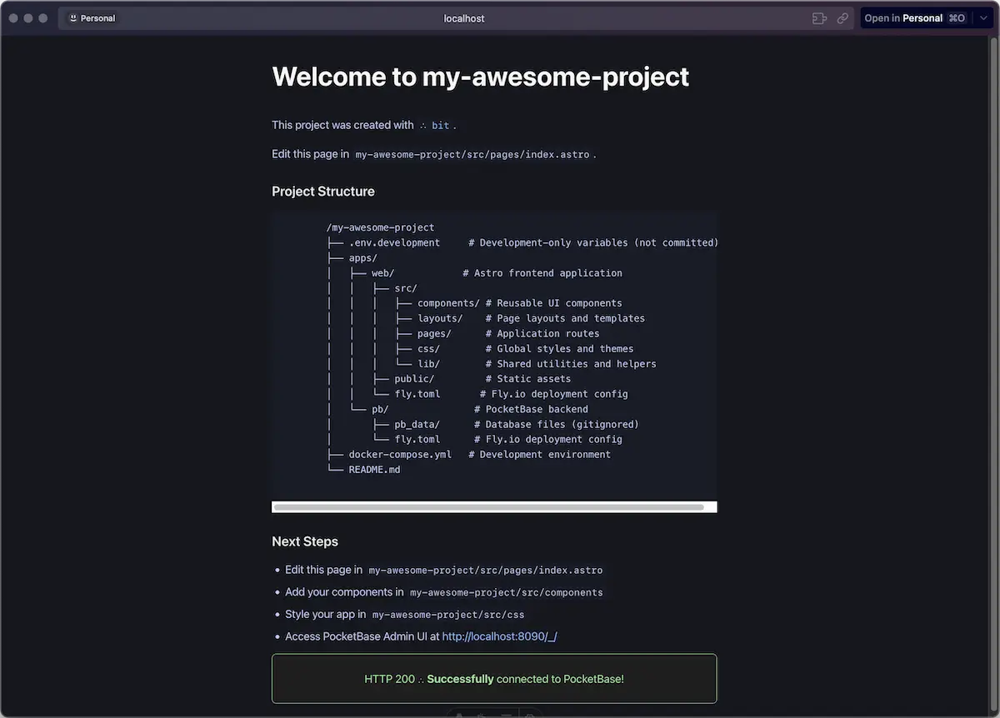

# ∴ bit → your stack sidekick
    


**Zero to Full-Stack in Seconds!** Create production-ready applications with a single command.


## ✨ What's in the Box?

Bit sets you up with a modern, battle-tested stack:

- 🌿 **[Monorepo](https://monorepo.tools/)** - Simple, organized and scalable from day one (`apps/pb` and `apps/web`)
- 🐋 **[Docker](https://www.docker.com/)** - Development environment that "just works"
- 📦 **[PocketBase Backend](https://pocketbase.io/)** - Full-featured backend with admin UI
- ✨ **[Astro Frontend](https://astro.build/)** - Blazing-fast web performance for pages and api endpoints (SSR by default on `bit`)
- 🍞 **[Bun](https://bun.sh/)** - Incredibly fast JavaScript runtime and toolkit for modern web development (powers bit's DX)

## 🚀 Get Started in 30 Seconds

1. Install Bit:

   ```bash
   npm install -g @mauricio.wolff/bit
   ```

2. Create your masterpiece:

   ```bash
   bit new my-awesome-project
   cd my-awesome-project
   ```

3. Choose your style:
   ```bash
   bit start # Press Ctrl+C to detach and keep services running
   ```

**That's it!** Visit your creation at:

- ✨ Frontend: http://localhost:4321
- 👔 Admin Dashboard: http://localhost:8090/\_/



## 🎮 Command Center

### During Development

| Command                 | Description                     |
|------------------------|---------------------------------|
| `bit new <name>`       | Create a new project           |
| `bit start`           | Start development environment   |
| `bit stop`            | Stop all services              |
| `bit logs`            | View containers logs              |
| `bit down`            | Delete all containers and volumes    |
| `bit deploy [target]` | Deploy to production           |

### Ready for the World?

| Command          | What it Does    |
| ---------------- | --------------- |
| `bit deploy`     | Ship everything |
| `bit deploy web` | Ship frontend   |
| `bit deploy pb`  | Ship backend    |

If your app doesn't exist in [fly.io](https://fly.io), it will `launch` first, then `deploy`.

## 📐 Project Blueprint

```
my-project/
├── apps/
│   ├── web/          # Astro frontend
│   │   ├── src/
│   │   └── fly.toml  # Frontend deploy config
│   └── pb/           # PocketBase backend
│       ├── pb_data/
│       ├── pb_migrations/
│       └── fly.toml   # Backend deploy config
├── docker-compose.yml # Development environment
└── README.md
```

## 🪄 Power User Features

### Auto-Magic Admin Setup

Create `~/.bit.conf` to use one email/password for PB's superuser (and to fastrack creation):

```json
{
  "pocketbase": {
    "admin": {
      "email": "pb-admin@your-domain.com",
      "password": "your-secure-password"
    }
  }
}
```

### 🚢 Deploy Like a Pro

We've partnered with [fly.io](https://fly.io) for smooth deployments:

1. Get the tools:

   ```bash
   curl -L https://fly.io/install.sh | sh
   ```

2. Log in:

   ```bash
   fly auth login
   ```

3. Ship it:
   ```bash
   bit deploy # From your project's root directory
   ```
   or
   ```bash
   bit deploy pb # Deploy PocketBase (db / backend) only
   bit deploy web # Deploy Astro (Frontend / api) only
   ```

### Deploying PocketBase to fly.io in real time


## 🧑‍💻 For the Builders

Want to make Bit even better? Here's how:

```bash
git clone https://github.com/bitbonsai/bit.git
cd bit
npm install
npm link
bit new test-project # Test your changes
```

## 📋 Before You Start

Make sure you have:

- 🐋 [Docker Desktop](https://www.docker.com/products/docker-desktop)
- ✈️ [Fly.io CLI](https://fly.io/docs/hands-on/install-flyctl/)
- 🍞 [Bun](https://bun.sh/) (recommended) or npm

## 🆘 Need Help?

Common hiccups and quick fixes:

- 🐋 **Docker not running?** Fire up Docker Desktop
- 🔌 **Port conflicts?** Check if 4321 or 8090 are free
- 🔐 **Permission issues?** Double-check Docker permissions
- 🫧 **Start fresh?** Run `bun run clean`

## 🤝 Join the Community

Got ideas? Found a bug? We love pull requests!

## ⚖️ License

MIT License - go wild! See [LICENSE](LICENSE) for the fine print.
